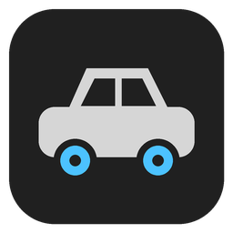
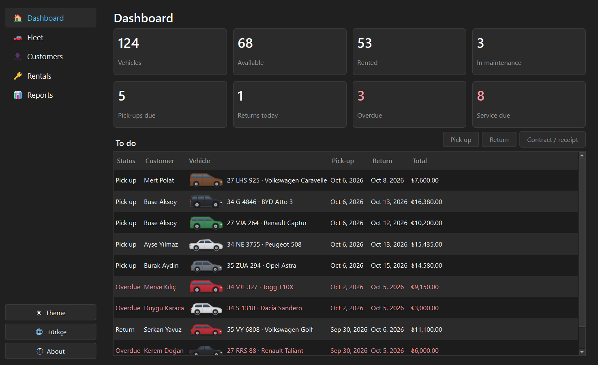
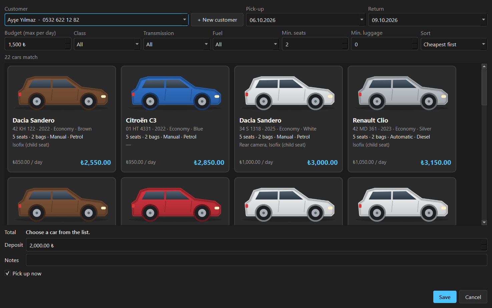
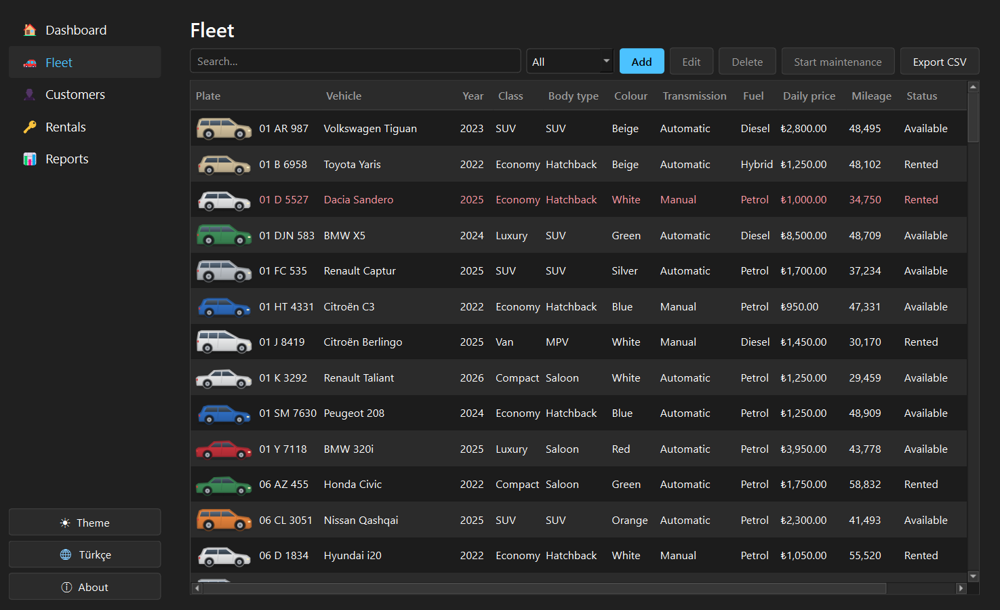
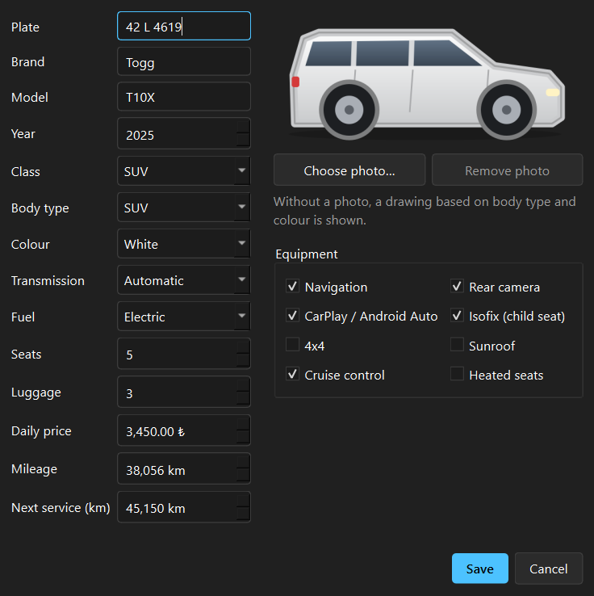
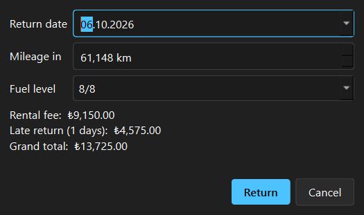
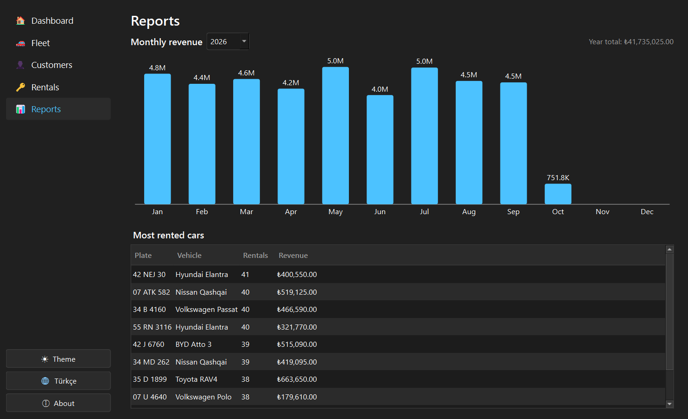
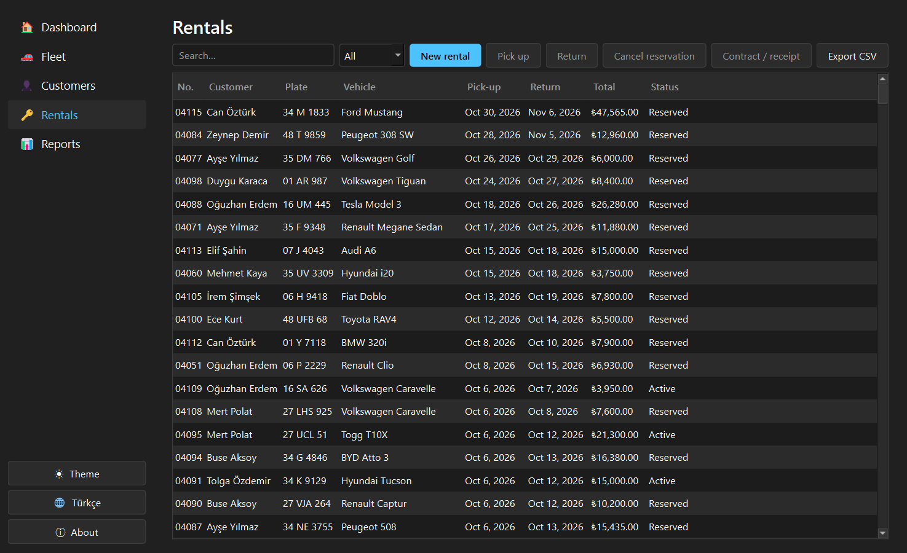
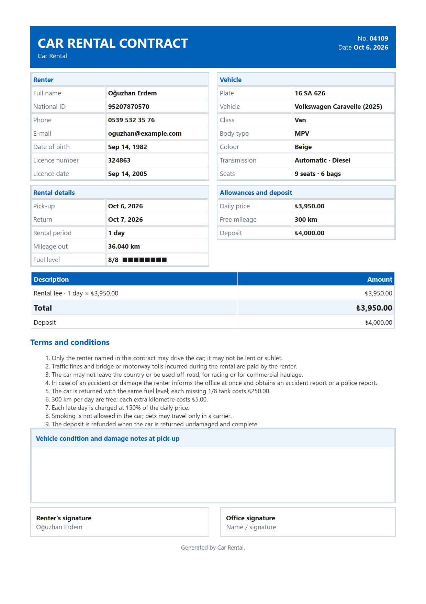
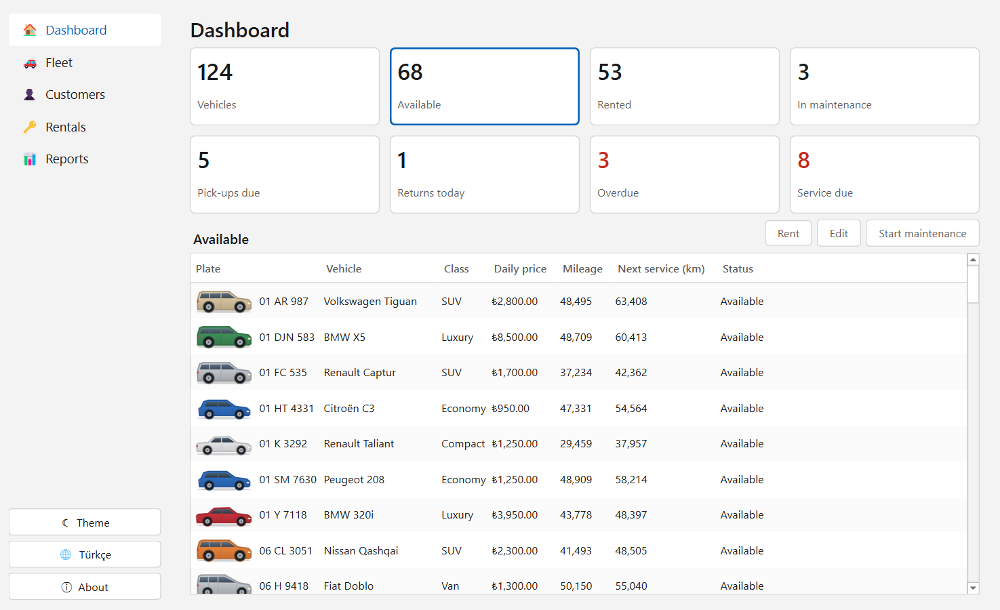

<p align="center">
  
</p>

<h1 align="center">Car Rental</h1>

<p align="center">
  <b>English</b> | <a href="README.tr.md">Türkçe</a>
</p>

<p align="center">
  A desktop management app for a small car rental office, written in C++20 and Qt 6.<br>
  Fleet, customers, double-booking-free reservations, pick-up and return, maintenance, PDF contracts and revenue reports.
</p>

<p align="center">
  <a href="https://github.com/MrcDprm/car-rental-system/releases/latest"><b>⬇️ Download for Windows</b></a>
</p>

<p align="center">
  
</p>

> **Note:** This is a portfolio project. The sample fleet, customers and rental history are fictional and
> generated on first start (optional). Car brand and model names belong to their owners; the car pictures
> are simple drawings generated in code. The app is available in English and Turkish.

## Features

**Dashboard**
- Eight status cards: total, available, rented, in maintenance, pick-ups due, returns today, overdue, service due
- Click a card to list its cars or rentals below and act on them right there (rent, pick up, return, maintenance, contract)

**Fleet**
- Plate, brand, model, year, class, body type, colour, transmission, fuel, seats, luggage, daily price, mileage
- Equipment tags: navigation, rear camera, CarPlay / Android Auto, Isofix, 4x4, sunroof, cruise control, heated seats
- Each car shows its own photo, or a drawing in its body type and colour when there is no photo
- Search, status filter, service warning 1,000 km before the next service, CSV export
- Maintenance: send a car to service and back, with cost and next service mileage; full history

**Rentals**
- Pick dates and see only the cars that are free on those dates; overlapping bookings are impossible
- Filter by budget (max price per day), class, transmission, fuel, minimum seats and luggage; cards show the total price
- Weekly (10%) and monthly (20%) discounts, deposit, notes; add a new customer without leaving the window
- Pick-up with actual mileage and fuel level; return with live late, extra mileage and missing fuel charges
- Reservation, active, returned and cancelled states with all changes in database transactions

**Customers**
- Turkish ID number validated with its check digits, phone and e-mail checks
- Business rules: at least 21 years old and a driving licence held for at least 2 years

**Documents and reports**
- One-page A4 PDF rental contract and return receipt: renter and car details, itemised charges, terms, damage notes and signature boxes
- Monthly revenue chart by year and the most rented cars
- CSV export for Excel (formula injection protection, Turkish Excel friendly separator)

**Desktop app**
- Dark and light theme, English and Turkish, About window, data in the user's folder, Windows installer
- Optional sample data on first start: about 120 cars from about 850 to 12,000 TRY per day, 25 customers and a year of history

## Screenshots

| New rental: filter by budget and needs | Fleet |
|:---:|:---:|
|  |  |

| Vehicle form | Return with live charges |
|:---:|:---:|
|  |  |

| Reports | Rentals |
|:---:|:---:|
|  |  |

| PDF contract | Light theme |
|:---:|:---:|
|  |  |

## Installation

1. Download `CarRental-1.0.0-Setup.exe` from the [Releases](https://github.com/MrcDprm/car-rental-system/releases/latest) page and run it. No administrator rights are needed.
   > The app is not digitally signed, so Windows SmartScreen may show a warning. Continue with **More info → Run anyway**.
2. On first start the app offers to load the sample fleet. Choose **No** to start with an empty database.

Data is stored in `%APPDATA%\MrcDprm\CarRental` (database, car photos, settings). Uninstall from the Windows "Apps" settings.

## Tech Stack

- **C++20**, **CMake**, **Ninja**, MinGW-w64 (MSYS2 UCRT64)
- **Qt 6**: Widgets (UI), Sql (SQLite), Gui (QPainter drawings, PDF), Test (unit tests)
- **SQLite**: local database
- **windeployqt**, **Inno Setup**: Windows installer

## Project Structure

```
src/
├── core/        Models, money in kuruş, pricing and return charges, validation rules (UI-independent)
├── data/        SQLite schema and repositories: vehicles, customers, rentals, maintenance, reports
├── services/    CSV export, PDF contract, photo storage, sample data
├── app/         Texts (EN/TR), settings, theme
├── ui/          Main window, pages, dialogs, car drawings and cards
└── main.cpp
resources/       Icon and version info template
tests/           Qt Test unit tests (core, data, services)
installer/       Deployment script and Inno Setup script
```

## Building from Source

[MSYS2](https://www.msys2.org) must be installed. Install the packages in the **MSYS2 UCRT64** terminal:

```
pacman -S --needed mingw-w64-ucrt-x86_64-toolchain mingw-w64-ucrt-x86_64-cmake mingw-w64-ucrt-x86_64-ninja mingw-w64-ucrt-x86_64-qt6-base
```

After adding `C:\msys64\ucrt64\bin` to PATH, run in the project folder:

```
cmake -S . -B build -G Ninja -DCMAKE_BUILD_TYPE=Release
cmake --build build
ctest --test-dir build --output-on-failure
```

To build the installer, also install [Inno Setup](https://jrsoftware.org/isinfo.php) and run:

```
powershell -ExecutionPolicy Bypass -File installer\deploy.ps1
ISCC installer\CarRental.iss
```

## What I Learned

- I split the app into layers: business rules (`core`) know nothing about the database or the UI, so I could test pricing, discounts, late fees and age rules with plain unit tests.
- I stored money as whole kuruş in a 64-bit integer instead of a floating-point number, because 0.1 + 0.2 is not exactly 0.3 and rounding errors are unacceptable on an invoice.
- I prevented double bookings with a half-open date range check (`[start, end)`): a car returned on the 10th can be rented again on the 10th. The check and the insert run in the same database transaction.
- I learned RAII in C++: my `Transaction` class rolls back in its destructor unless it was committed, so an early `return` or an error can never leave half-written data.
- I wrote every SQL query with parameters (`?` and `addBindValue`), never with string concatenation, and added a test that tries SQL injection through the inputs.
- I learned not to trust data from outside: values read from the database fall back to safe defaults, photo file names must match a strict pattern so they cannot point outside the photo folder, and selected photos are checked by content, shrunk and re-encoded before they are stored.
- I protected CSV exports against formula injection (cells starting with `=`, `+`, `-`, `@`) and escaped every user value I put into the PDF's HTML.
- I drew the car pictures and the revenue chart with `QPainter` instead of using images or a chart library, and used `QStyledItemDelegate` to paint the car cards so a list of 120 cars stays smooth.
- I fixed a tiny-text PDF bug by telling `QTextDocument` to lay out text for the PDF's 300 dpi instead of the screen's resolution.
- I generated a realistic sample dataset with a fixed random seed, and wrote a test that checks it: every car is valid, no rentals overlap and every car's status matches its rentals.
- I packaged a Qt app for Windows: `windeployqt` for Qt files, a script that finds the remaining DLLs with `objdump`, and an Inno Setup installer that needs no administrator rights.

## Future Plans

- Staff accounts with roles (office worker, manager)
- Several branches and moving cars between them
- Damage photos at pick-up and return, attached to the contract
- Online booking form connected to the same database
- Printing directly to a printer and e-mailing the contract to the customer

## License

[MIT](LICENSE)
