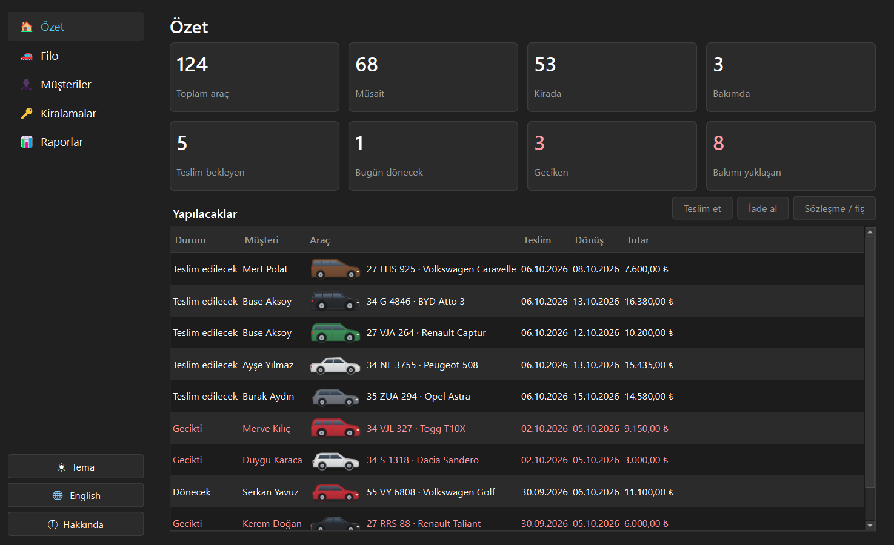
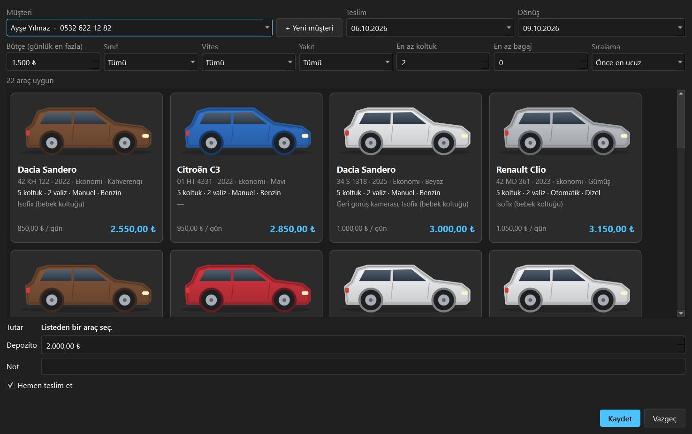
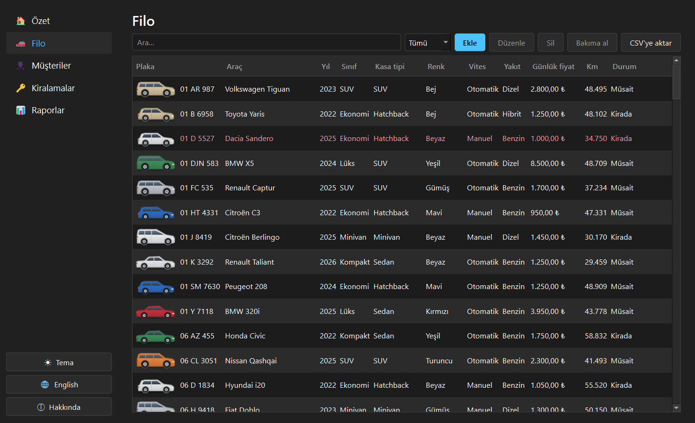
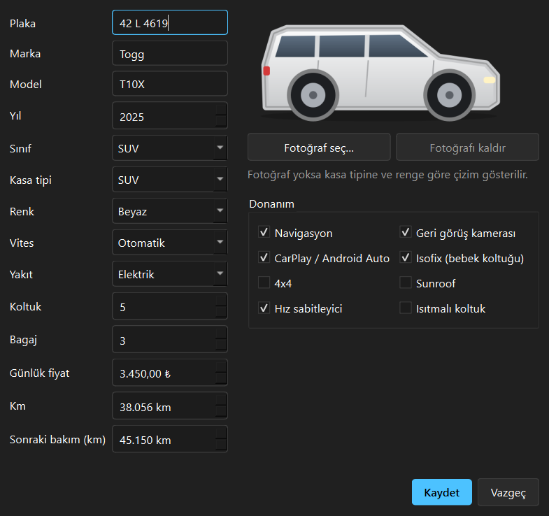
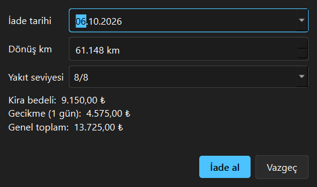
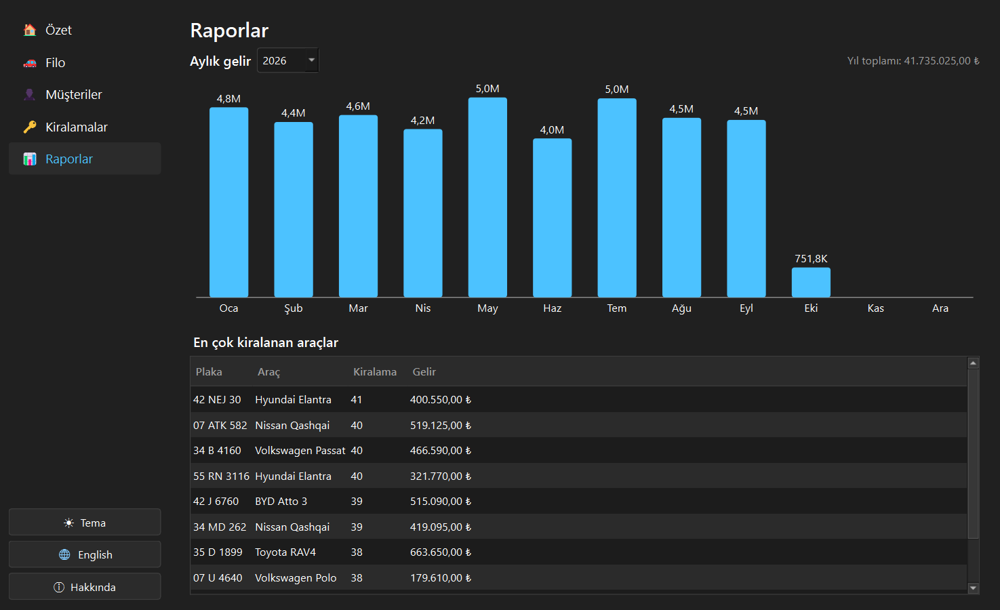
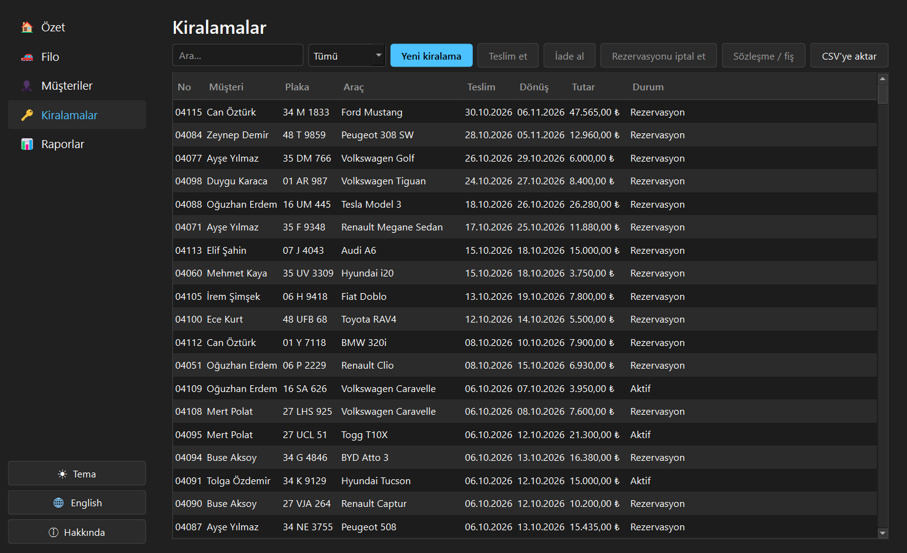
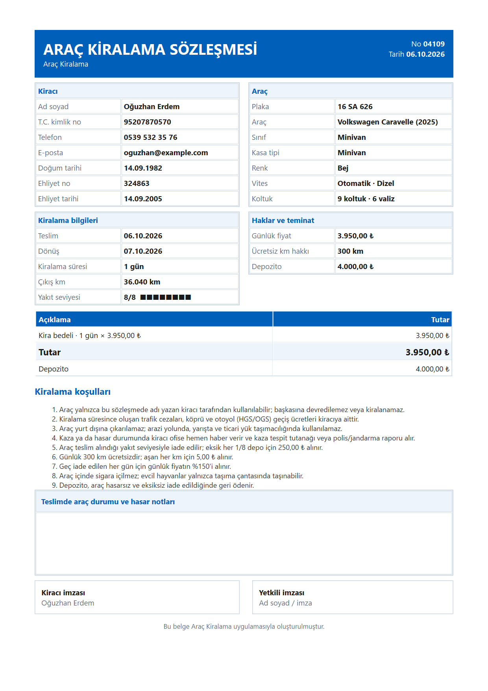
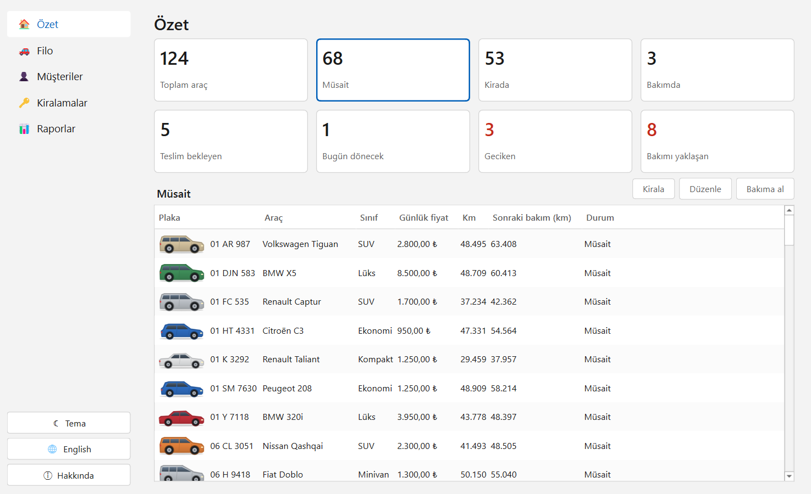

<p align="center">
  
</p>

<h1 align="center">Araç Kiralama</h1>

<p align="center">
  <a href="README.md">English</a> | <b>Türkçe</b>
</p>

<p align="center">
  Küçük bir araç kiralama ofisi için C++20 ve Qt 6 ile yazılmış masaüstü yönetim uygulaması.<br>
  Filo, müşteriler, çakışmasız rezervasyon, teslim ve iade, bakım, PDF sözleşme ve gelir raporları.
</p>

<p align="center">
  <a href="https://github.com/MrcDprm/car-rental-system/releases/latest"><b>⬇️ Windows için indir</b></a>
</p>

<p align="center">
  
</p>

> **Not:** Bu bir portfolyo projesidir. Örnek filo, müşteriler ve kiralama geçmişi hayalidir ve ilk açılışta
> (isteğe bağlı) oluşturulur. Araç marka ve model adları sahiplerine aittir; araç görselleri kodla üretilen
> basit çizimlerdir. Uygulama Türkçe ve İngilizce kullanılabilir.

## Özellikler

**Özet ekranı**
- Sekiz durum kartı: toplam, müsait, kirada, bakımda, teslim bekleyen, bugün dönecek, geciken, bakımı yaklaşan
- Karta tıklayınca o kartın araçları ya da kiralamaları altta listelenir ve oradan işlem yapılır (kirala, teslim et, iade al, bakım, sözleşme)

**Filo**
- Plaka, marka, model, yıl, sınıf, kasa tipi, renk, vites, yakıt, koltuk, bagaj, günlük fiyat, km
- Donanım etiketleri: navigasyon, geri görüş kamerası, CarPlay / Android Auto, Isofix, 4x4, sunroof, hız sabitleyici, ısıtmalı koltuk
- Her aracın kendi fotoğrafı, fotoğraf yoksa kasa tipine ve rengine göre çizimi görünür
- Arama, durum filtresi, sonraki bakıma 1.000 km kala uyarı, CSV'ye aktarma
- Bakım: aracı bakıma alma ve çıkarma, maliyet ve sonraki bakım km'si; bakım geçmişi

**Kiralamalar**
- Tarih seçince sadece o tarihlerde boş araçlar listelenir; çakışan rezervasyon yapılamaz
- Bütçe (günlük en fazla fiyat), sınıf, vites, yakıt, en az koltuk ve bagaj filtreleri; kartlarda toplam fiyat
- Haftalık (%10) ve aylık (%20) indirim, depozito, not; pencereden çıkmadan yeni müşteri ekleme
- Teslimde gerçek km ve yakıt seviyesi; iadede gecikme, fazla km ve eksik yakıt ücretleri anında hesaplanır
- Rezervasyon, aktif, iade edildi ve iptal durumları; tüm değişiklikler veritabanı işlemleri (transaction) içinde

**Müşteriler**
- T.C. kimlik numarası sağlama basamaklarıyla, telefon ve e-posta kontrolü
- İş kuralları: en az 21 yaş ve en az 2 yıllık ehliyet

**Belgeler ve raporlar**
- Tek sayfa A4 PDF kiralama sözleşmesi ve iade fişi: kiracı ve araç bilgileri, kalem kalem ücretler, koşullar, hasar notları ve imza kutuları
- Yıla göre aylık gelir grafiği ve en çok kiralanan araçlar
- Excel için CSV (formül enjeksiyonu koruması, Türkçe Excel'e uygun ayırıcı)

**Masaüstü uygulaması**
- Koyu ve açık tema, Türkçe ve İngilizce, Hakkında penceresi, veriler kullanıcı klasöründe, Windows kurulum dosyası
- İlk açılışta isteğe bağlı örnek veri: günlük ~850 ile 12.000 TL arası yaklaşık 120 araç, 25 müşteri ve bir yıllık geçmiş

## Ekran Görüntüleri

| Yeni kiralama: bütçeye ve ihtiyaca göre filtre | Filo |
|:---:|:---:|
|  |  |

| Araç formu | Ücretleri anında hesaplayan iade |
|:---:|:---:|
|  |  |

| Raporlar | Kiralamalar |
|:---:|:---:|
|  |  |

| PDF sözleşme | Açık tema |
|:---:|:---:|
|  |  |

## Kurulum

1. [Releases](https://github.com/MrcDprm/car-rental-system/releases/latest) sayfasından `CarRental-1.0.0-Setup.exe` dosyasını indirip çalıştır. Yönetici izni gerekmez.
   > Uygulama dijital olarak imzalı olmadığı için Windows SmartScreen uyarı gösterebilir. **Ek bilgi → Yine de çalıştır** ile devam edebilirsin.
2. İlk açılışta uygulama örnek filoyu yüklemeyi önerir. Boş veritabanıyla başlamak için **Hayır** de.

Veriler `%APPDATA%\MrcDprm\CarRental` klasöründe tutulur (veritabanı, araç fotoğrafları, ayarlar). Kaldırmak için Windows "Uygulamalar" ayarlarını kullan.

## Kullanılan Teknolojiler

- **C++20**, **CMake**, **Ninja**, MinGW-w64 (MSYS2 UCRT64)
- **Qt 6**: Widgets (arayüz), Sql (SQLite), Gui (QPainter çizimleri, PDF), Test (birim testleri)
- **SQLite**: yerel veritabanı
- **windeployqt**, **Inno Setup**: Windows kurulum dosyası

## Proje Yapısı

```
src/
├── core/        Modeller, kuruş cinsinden para, fiyat ve iade ücretleri, doğrulama kuralları (arayüzden bağımsız)
├── data/        SQLite şeması ve depolar: araçlar, müşteriler, kiralamalar, bakım, raporlar
├── services/    CSV'ye aktarma, PDF sözleşme, fotoğraf saklama, örnek veri
├── app/         Metinler (TR/EN), ayarlar, tema
├── ui/          Ana pencere, sayfalar, pencereler, araç çizimleri ve kartları
└── main.cpp
resources/       İkon ve sürüm bilgisi şablonu
tests/           Qt Test birim testleri (core, data, services)
installer/       Dağıtım betiği ve Inno Setup betiği
```

## Kaynaktan Derleme

[MSYS2](https://www.msys2.org) kurulu olmalı. Paketleri **MSYS2 UCRT64** terminalinde kur:

```
pacman -S --needed mingw-w64-ucrt-x86_64-toolchain mingw-w64-ucrt-x86_64-cmake mingw-w64-ucrt-x86_64-ninja mingw-w64-ucrt-x86_64-qt6-base
```

`C:\msys64\ucrt64\bin` klasörünü PATH'e ekledikten sonra proje klasöründe:

```
cmake -S . -B build -G Ninja -DCMAKE_BUILD_TYPE=Release
cmake --build build
ctest --test-dir build --output-on-failure
```

Kurulum dosyasını oluşturmak için [Inno Setup](https://jrsoftware.org/isinfo.php) da kurulu olmalı:

```
powershell -ExecutionPolicy Bypass -File installer\deploy.ps1
ISCC installer\CarRental.iss
```

## Öğrendiklerim

- Uygulamayı katmanlara ayırdım: iş kuralları (`core`) veritabanını ve arayüzü hiç bilmiyor. Böylece fiyat, indirim, gecikme ücreti ve yaş kurallarını sade birim testleriyle test edebildim.
- Parayı ondalıklı sayı yerine 64 bitlik tam sayı olarak kuruş cinsinden tuttum; çünkü 0.1 + 0.2 tam olarak 0.3 etmez ve faturada yuvarlama hatası kabul edilemez.
- Çift rezervasyonu yarı açık tarih aralığı kontrolüyle (`[başlangıç, bitiş)`) engelledim: 10'unda dönen araç 10'unda yeniden kiralanabiliyor. Kontrol ve kayıt aynı veritabanı işleminde çalışıyor.
- C++'ta RAII'yi öğrendim: `Transaction` sınıfım commit edilmediyse yıkıcısında işlemi geri alıyor. Erken bir `return` ya da hata yarım yazılmış veri bırakamıyor.
- Bütün SQL sorgularını string birleştirmeyle değil parametreyle (`?` ve `addBindValue`) yazdım ve girdilerden SQL injection deneyen bir test ekledim.
- Dışarıdan gelen veriye güvenmemeyi öğrendim: veritabanından okunan değerler bozuksa güvenli varsayılana düşüyor; fotoğraf dosya adları katı bir kalıba uymak zorunda, yani fotoğraf klasörünün dışını gösteremiyor; seçilen fotoğraflar içeriğinden kontrol edilip küçültülüyor ve yeniden kodlanıyor.
- CSV'yi formül enjeksiyonuna (`=`, `+`, `-`, `@` ile başlayan hücreler) karşı korudum, PDF'in HTML'ine koyduğum her kullanıcı verisini kaçışladım.
- Araç görsellerini ve gelir grafiğini resim dosyası ya da grafik kütüphanesi yerine `QPainter` ile çizdim. Araç kartlarını `QStyledItemDelegate` ile çizdiğim için 120 araçlık liste de akıcı kalıyor.
- PDF'te yazıların minicik çıkması hatasını, `QTextDocument`'e metni ekran çözünürlüğüne göre değil PDF'in 300 dpi'ına göre yerleştirmesini söyleyerek çözdüm.
- Sabit rastgele tohumla gerçekçi bir örnek veri seti ürettim ve bunu kontrol eden bir test yazdım: her araç geçerli, kiralamalar çakışmıyor ve her aracın durumu kiralamalarıyla tutarlı.
- Bir Qt uygulamasını Windows için paketledim: Qt dosyaları için `windeployqt`, kalan DLL'leri `objdump` ile bulan bir betik ve yönetici izni gerektirmeyen bir Inno Setup kurulum dosyası.

## Gelecek Planları

- Rollere göre çalışan hesapları (ofis çalışanı, yönetici)
- Birden fazla şube ve şubeler arası araç transferi
- Teslim ve iadede hasar fotoğrafları, sözleşmeye eklenmiş olarak
- Aynı veritabanına bağlı online rezervasyon formu
- Sözleşmeyi doğrudan yazıcıya gönderme ve müşteriye e-postayla yollama

## Lisans

[MIT](LICENSE)
